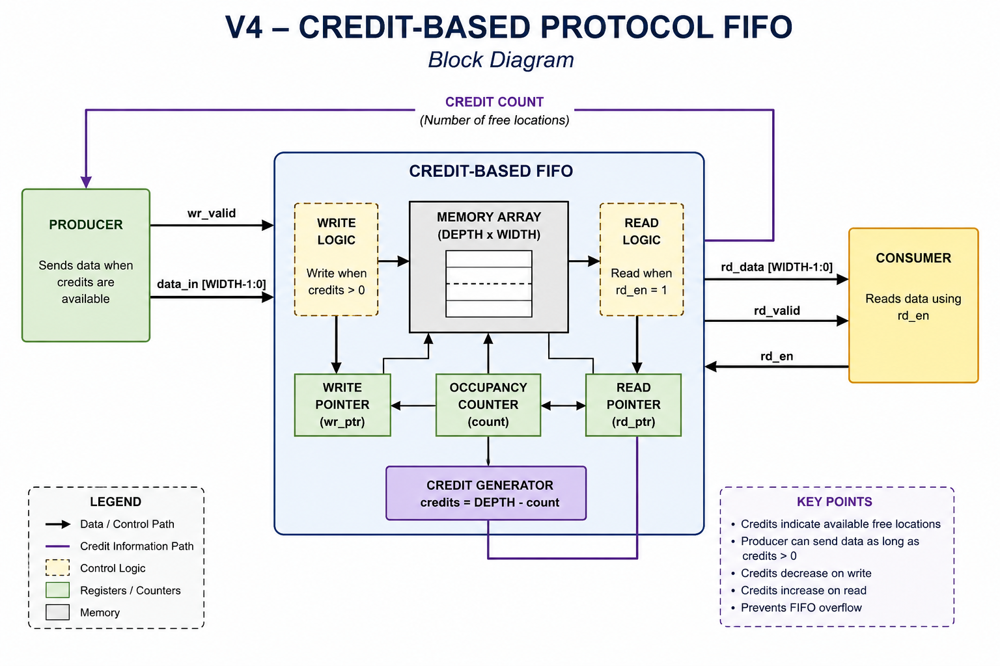
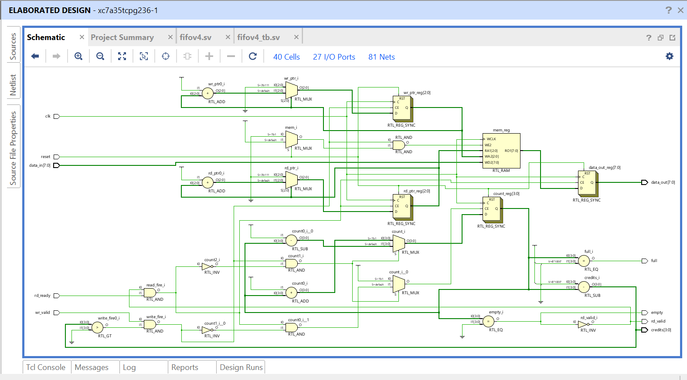
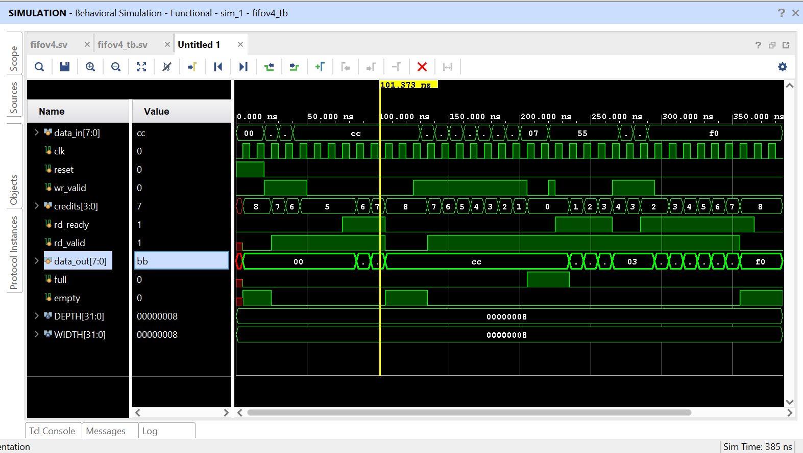

# FIFO Version 4 – Credit-Based Flow Control Protocol

## Overview

This project implements **Version 4** of a parameterized synchronous FIFO using the **Credit-Based Flow Control Protocol**, a commonly used flow-control mechanism in high-performance communication systems such as Networks-on-Chip (NoCs), PCIe, and high-speed interconnects.

Unlike the Valid-Ready protocol, where the receiver provides immediate back pressure, the Credit-Based protocol allows the producer to keep track of the number of available FIFO locations (credits) and transmit data only while credits are available.

This repository builds upon the previous FIFO implementations by introducing explicit credit management while retaining support for simultaneous read and write operations.

---

## Features

- Parameterized FIFO depth and data width
- Synchronous design using SystemVerilog
- Circular buffer implementation
- Credit-Based flow control
- Producer transmits data only when credits are available
- Credits decrease after every successful write
- Credits increase after every successful read
- Automatic back pressure when credits reach zero
- Simultaneous read and write support
- FIFO Full and Empty flag generation
- Data integrity and FIFO ordering verified through simulation

---

## Credit-Based Flow Control

The FIFO exposes the number of available storage locations through a **credits** signal.

- Producer checks the available credits before sending data.
- Every successful write consumes one credit.
- Every successful read returns one credit.
- When credits become zero, the FIFO is full and further writes are blocked until data is read.

This protocol eliminates the need for the producer to continuously monitor the FIFO status signals, making it well suited for pipelined and high-throughput systems.

---

## Block Diagram



---

## RTL Schematic

Generated using Vivado after RTL elaboration.



---

## Simulation Waveforms

The simulation verifies:

- Basic write operations
- Basic read operations
- Credit decrement during writes
- Credit increment during reads
- FIFO full condition
- Write blocking when credits reach zero
- Writing after credits are restored
- Simultaneous read and write
- FIFO empty condition



---

## Simulation Log

The complete simulation console output is available in:

```
simulation_log.txt
```

The log demonstrates:

- FIFO pointer movement
- Credit updates
- Read and write transactions
- FIFO full detection
- Back pressure behavior
- Data ordering verification

---

## Files

| File | Description |
|------|-------------|
| `fifov4.sv` | Credit-Based FIFO implementation |
| `fifov4_tb.sv` | Comprehensive SystemVerilog testbench |
| `block_diagram.png` | Credit protocol architecture |
| `rtl_schematic.png` | RTL schematic generated in Vivado |
| `fifo_v4_simulation.png` | Simulation waveform |
| `simulation_log.txt` | Console output from simulation |

---

## Tools Used

- Vivado 2025.2
- XSim Simulator
- SystemVerilog

---

## Learning Outcomes

Through this implementation, the following concepts were explored:

- Credit-Based Flow Control
- FIFO memory architecture
- Circular buffer implementation
- Read and write pointer management
- Flow control mechanisms
- Back pressure
- Simultaneous read/write handling
- Parameterized hardware design
- SystemVerilog RTL design
- Functional verification using testbenches

---

## Future Improvements

Potential future enhancements include:

- Dual-clock (Asynchronous) FIFO
- Gray-code pointer synchronization
- Almost Full / Almost Empty flags
- First Word Fall Through (FWFT) FIFO
- AXI-Stream compatible FIFO
- UVM-based verification environment
- Assertion-based verification (SVA)

---

## Author

**Ananya Satish**

ECE Undergraduate | Digital Design & VLSI Enthusiast

This project is part of a series of progressively enhanced FIFO implementations developed to understand industrial FIFO architectures and modern flow-control techniques.
